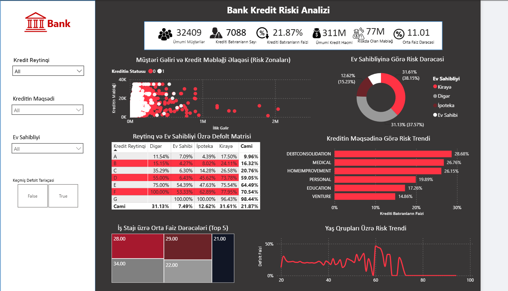
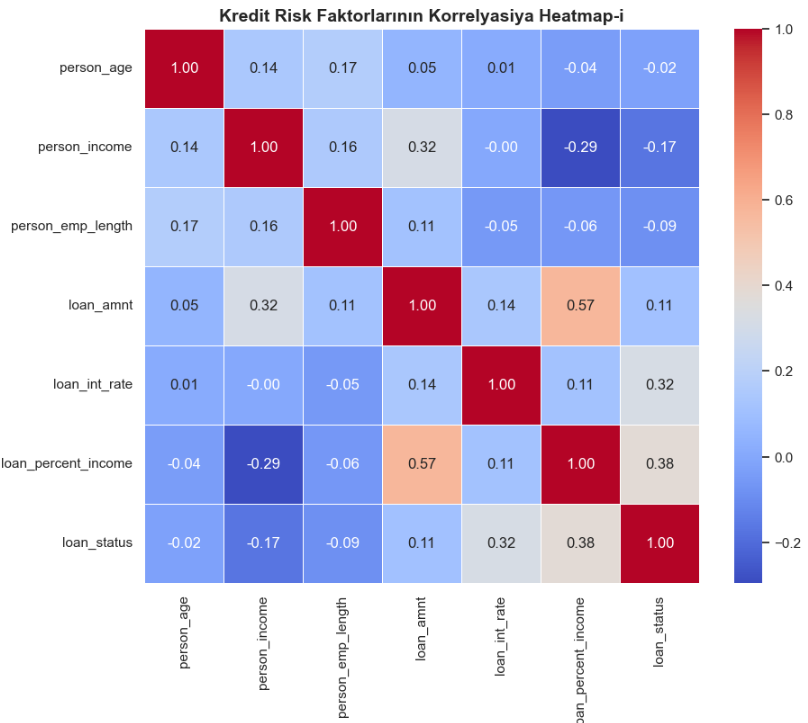

# 🏦 Credit Risk Analytics Dashboard

## 📌 Layihə Haqqında (About the Project)
* **AZ:** Bu layihə, bank mühitində kredit risklərinin effektiv idarə edilməsi və optimallaşdırılması üçün hazırlanıb. Müştərilərin demoqrafik göstəriciləri (yaş, iş təcrübəsi), ümumi gəlirləri (əsas maaş və komissiya bonusları) və kredit xüsusiyyətləri analiz edilir. Məqsəd — hansı müştərilərin ödənişi gecikdirə biləcəyini (**Default riski**) əvvəlcədən təyin etmək və bu riskləri modern, tünd rejimli (**Dark Mode**) interaktiv dashboard-lar vasitəsilə qərarvericilərə təqdim etməkdir.
* **EN:** This project is designed to enhance credit risk management in banking. It analyzes customer demographics (age, work experience), total income (base salary and commission bonuses), and loan characteristics. The goal is to identify high-risk borrowers (**Default Risk**) and visualize these insights through modern, Dark Mode interactive dashboards for efficient credit decision-making.

---

## 🎨 Layihənin Dashboard Görünüşü

---
## 🛡️ Məlumat Təhlükəsizliyi və İdarə Edilməsi

Bu layihədə bank standartlarına uyğun olaraq müştərilərin fərdi məlumatlarının (PII) qorunması və data təhlükəsizliyi qaydaları tətbiq olunmuşdur. Hansı məlumatların həssas sayıldığı və necə qorunduğu barədə ətraflı məlumatı ayrıca sənədləşmədən oxuya bilərsiniz:
 [Məlumat təhlükəsizliyi və lüğəti sənədini oxu (DATA_GOVERNANCE.md)](./DATA_GOVERNANCE.md)
---

## 🛠 Texnologiyalar (Tech Stack)
* **Python** (Data Processing & Cleaning)
* **SQL** (Data Querying & Segmentation)
* **Power BI** (Data Modeling & UI/UX Dashboarding)

---

## 🚀 Layihə Mərhələləri (Project Stages)
* [x] 🏗️ Repozitoriyanın qurulması (Repository Setup)
* [x] 📝 README sənədləşməsinin hazırlanması (Documentation)
* [x] 🛠️ Python ilə məlumatların ilkin emalı (Python Data Cleaning)
* [x] 📊 Python ilə analiz (Python EDA & Risk Analytics)
* [x] 🗄️ SQL sorğuları ilə analitika (SQL Analytics)
* [x] 📐 Power BI-da Data Modeling və DAX (Modeling & DAX)
* [x] 🎨 Dashboard Dizaynı və UI/UX Optimallaşdırılması (Dashboard Finalization)

---

## 📊 Dataset Haqqında (About the Dataset)
* **AZ:** Bu layihədə istifadə olunan dataset bank müştərilərinin kredit tarixçələrini və demoqrafik məlumatlarını əks etdirir. Dataset ümumilikdə **32,409** müştərinin məlumatından və risk analizində kritik rol oynayan fərqli göstəricilərdən (sütunlardan) ibarətdir.
* **EN:** The dataset used in this project represents bank customers' credit histories and demographic data. It includes information for **32,409** customers and features critical indicators used in credit risk analysis.

### 📋 Göstəricilərin Təsviri (Data Dictionary)

| Column Name | Təsvir (Description) |
| :--- | :--- |
| **person_age** | Müştərinin yaşı |
| **person_income** | Müştərinin illik ümumi gəliri |
| **person_home_ownership** | Yaşayış şəraiti (Kirayə, İpoteka, Şəxsi, Digər) |
| **person_emp_length** | Müştərinin iş təcrübəsi (il ilə) |
| **loan_intent** | Kreditin götürülmə səbəbi (Təhsil, Tibb, Şəxsi və s.) |
| **loan_grade** | Bank daxili risk reytinqi (A-G) |
| **loan_amnt** | Götürülən kreditin ümumi məbləği |
| **loan_int_rate** | Kreditə tətbiq olunan faiz dərəcəsi |
| **loan_status** | Defolt vəziyyəti (0 = Ödəyir, 1 = Defolt/Gecikdirir) |
| **loan_percent_income** | Götürülən kreditin illik gəlirə olan nisbəti (faizlə) |
| **cb_person_default_on_file** | Əvvəllər rəsmi ödəniş gecikdirilməsinin olması (Y/N) |
| **cb_person_cred_hist_length** | Müştərinin kredit tarixçəsinin uzunluğu (il ilə) |

---

## 🛠️ Məlumatların Təmizlənməsi (Data Cleaning & Quality Control)
Xam məlumatlar (`credit_risk_dataset.csv`) proqram mühitinə yükləndikdən sonra, modelin dəqiqliyini qorumaq və risk analizini düzgün aparmaq üçün genişmiqyaslı data təmizlənməsi prosesi icra edilmişdir.

### 1. Boş Xanaların Doldurulması (Missing Values Imputation)
İnformasiya itkisinin qarşısının alması məqsədilə boş olan xanalar (NaN) datadan silinməmiş, hər sütunun öz **median** göstəricisi ilə tamamlanmışdır:
* **`person_emp_length`** (İş təcrübəsi): `895` boş xana dolduruldu.
* **`loan_int_rate`** (Kredit faizi): `3,116` boş xana dolduruldu.

### 2. Anomaliyaların Təmizlənməsi (Outliers Filtration)
Biznes məntiqinə və real insan limitlərinə uyğun gəlməyən sistem xətaları (ekstremal kənarlaşmalar) filtrlənərək təmizlənmişdir.

| Sütun Adı | Əvvəlki Maksimum | Görülən Tədbir | Sonrakı Maksimum |
| :--- | :---: | :--- | :---: |
| **person_age** | 144 yaş | > 100 olan 5 sətir silindi | 94 yaş |
| **person_emp_length** | 123 il | > 60 olan 2 sətir silindi | 41 il |

### 3. Yekun Keyfiyyət Kontrolu (Final QC Metrics)
Təkrar (dublikat) sətirlər yoxlanılmış, indekslər sıfırlanmış və yekun master-data növbəti mərhələlər üçün `../data/cleaned/credit_risk_cleaned.csv` ünvanına təhlükəsiz şəkildə eksport edilmişdir. 

* **Yekun ölçü:** 32,409 sətir, 12 ana sütun.

---

## 📊 Kredit Riski Analizi - Kəşfiyyatçı Data Analizi (EDA)
Bu qovluqdakı `credit_eda.ipynb` notebook-u çərçivəsində təmizlənmiş kredit məlumatları vizual və statistik olaraq analiz edilmiş, risk faktorları aşkar olunmuşdur.

### 🎯 Layihənin Məqsədi
Bankın kredit riskini (`loan_status`) daha effektiv idarə etmək üçün datadakı daxili qanunauyğunluqları, ən kritik risk faktorlarını və müştəri seqmentlərinin Default (kredit batma) dərəcələrini aşkar etmək, həmçinin datanı növbəti SQL/Modelləşdirmə mərhələsinə hazırlamaqdır.

### 📉 Korrelyasiya Heatmap Matrix

### 🛠️ Nələr Edildi? (Görülən İşlər)
* **Datanın Yüklənməsi və Struktur Təhlili:** 32,409 sətir və 13 sütundan ibarət təmizlənmiş kredit risk datası layihəyə daxil edildi.
* **Korrelyasiya Analizi (Heatmap Matrix):** Hədəf dəyişənimiz (`loan_status`) ilə müştərinin yaşı, gəliri, iş stajı, kredit məbləği və faiz dərəcəsi kimi 7 əsas rəqəmsal metrika arasındakı əlaqələr *Pearson Korrelyasiyası* ilə hesablandı və vizuallaşdırıldı.
* **Seqmentasiya Analizi (Ev Sahibliyi):** Müştərilərin ev sahibliyi statusunun (`person_home_ownership`) kredit batma faizlərinə təsiri çarpaz cədvəl (*Crosstab*) və *Stacked Bar chart* vasitəsilə analiz olundu.

---

## 🚨 Əsas Biznes Tapıntıları və Strateji Qərarlar (Key Insights & Business Decisions)
Analiz nəticəsində bankın risk menecmenti üçün kritik əhəmiyyət kəsb edən aşağıdakı **4 əsas qərar** müəyyən edilmişdir:

> ⚠️ **1. Ən Böyük Risk (Borcun Gəlirə Nisbəti - 0.38):** Kredit məbləğinin müştərinin illik gəlirindəki payı artdıqca risk kəskin şəkildə yüksəlir.
> * **Biznes Qərarı:** Gəlirinə görə çox böyük məbləğdə kredit istəyən şəxslərə ciddi limitlər qoyulmalıdır.

> 📈 **2. Yüksək Kredit Faizləri (0.32):** Faiz dərəcəsi yüksək olduqca aylıq ödəniş ağırlaşır və kreditin batma riski artır.
> * **Biznes Qərarı:** Yüksək faizli kredit alan müştərilərdən əlavə zamin və ya girov tələb olunmalıdır.

> 💰 **3. İllik Gəlir Faktoru (-0.17):** Müştərinin illik gəliri artdıqca kreditin batma riski azalır (mənfi əlaqə).
> * **Biznes Qərarı:** Yüksək gəlirli müştərilərə kreditlər daha sürətli və asan şərtlərlə təsdiqlənməlidir.

> 🏠 **4. Ev Sahibliyi Statusu (Ən Kritik Seqment):** Kirayədə qalan (RENT) və OTHER statuslu müştərilərin kredit batırma faizi ~30%-ə yaxındır. Öz evi olanlarda (OWN) isə bu risk 10%-dən aşağıdır.
> * **Biznes Qərarı:** Kredit şöbəsi kirayədə qalan müştərilərə kredit ayırarkən daha ciddi anderraytinq (yoxlama) şərtləri tətbiq etməli və risk premiumunu fərqli hesablamalıdır.
